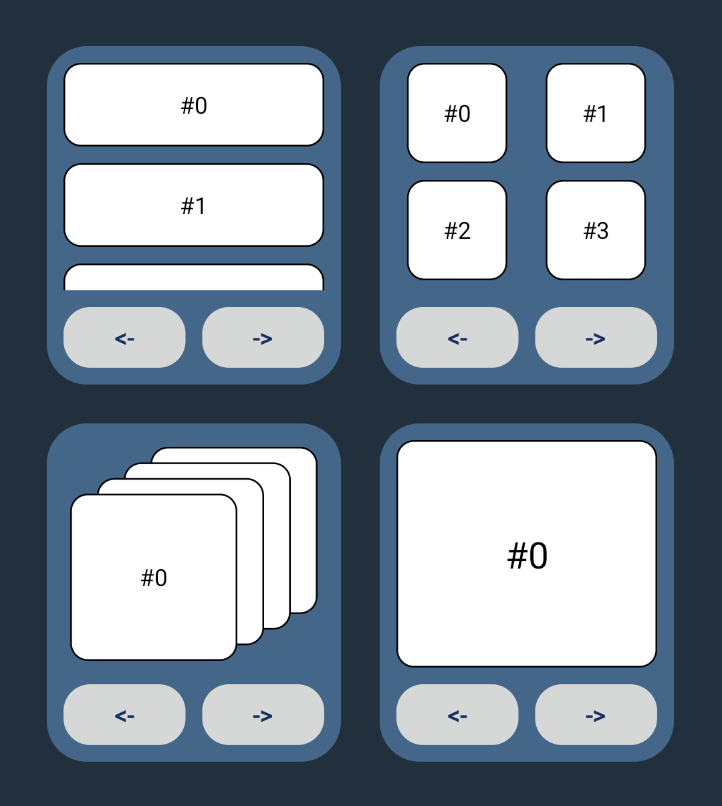

# Glimpse

Tools and extended composables for [Glance app widgets on Android][glance]

<br />

- **GlanceModifier.remoteAdapter**

  Allows the use of `AdapterView`s with `AndroidRemoteViews`, giving us access
  to `StackView` and `AdapterViewFlipper`, analogs for which Glance doesn't yet
  have.

- **ScrollableLazyColumn & ScrollableLazyVerticalGrid**

  These extended composables add a state parameter that gives access to
  `AdapterView`'s `smoothScrollToPosition` and `smoothScrollByOffset` methods,
  allowing programmatic scroll on API levels 31+ (which `remoteAdapter` also
  offers).

<br />

## Contents

- [**Setup**](#setup)
- [**GlanceModifier.remoteAdapter**](#glancemodifierremoteadapter)
- [**ScrollableLazyColumn & ScrollableLazyVerticalGrid**](#scrollablelazycolumn--scrollablelazyverticalgrid)
- [**Version map**](#version-map)
- [**Notes**](#notes)
- [**Documentation ↗**][documentation]

<br />

## Setup

The library accomplishes its effects by slightly altering Glance's bytecode to
insert calls to local code where the underlying `RemoteViews` are modified
directly. The bytecode manipulation is handled by a custom Gradle plugin that
uses [a built-in AGP functionality][transform] along with some basic Java ASM.

### Publishing

For the time being, the `library` and `plugin` modules will have to be built and
published manually in order to be able to use this (unless you'd like to include
the projects directly). If you use a local Maven repository, all it takes is to
run two predefined Gradle tasks in this project, and then to add a couple of
`mavenLocal()` lines to your app's project.

1. In Glimpse, run `./gradlew :library:publishToMavenLocal` either through a
   terminal, or from the Gradle task window in Android Studio. (Or, if you're
   reading this in your IDE and that command renders as an action, just run it
   from here.)

2. In Glimpse again, run `./gradlew :plugin:publishToMavenLocal` the same way.

3. In your app project's `settings.gradle.kts`, assuming a modern setup, add
   `mavenLocal()` to the `repositories {}` blocks that are inside both the
   `pluginManagement {}` block, and the `dependencyResolutionManagement {}`
   block. For example:

   ```kotlin
   pluginManagement {
       repositories {
           …
           mavenLocal()
       }
   }
   dependencyResolutionManagement {
       …
       repositories {
           …
           mavenLocal()
       }
   }
   …
   ```

That's it. The repository, which is just a directory under your user account's
home, will be set up automagically, if it's not already there. After that, this
is a standard plugin and dependency setup, which these days looks something like
the following.

### App configuration

Note that the library and plugin are currently being published using the hosting
service's domain, so their ID – `io.github.gonodono.glimpse`– is different than
the Java package name used in code, `dev.gonodono.glimpse`. The `io.github`
identifiers are only ever used for the build dependencies.

Also note that the main module is named `library` in the source code in order to
avoid naming conflicts, but it's published as `glimpse`.

`libs.versions.toml`:

```toml
[versions]
#…
glimpse = "0.0.1"

[libraries]
#…
glimpse-library = { module = "io.github.gonodono.glimpse:glimpse", version.ref = "glimpse" }

[plugins]
#…
glimpse-plugin = { id = "io.github.gonodono.glimpse", version.ref = "glimpse" }
```

Project's `build.gradle.kts`:

```kotlin
plugins {
    …
    alias(libs.plugins.glimpse.plugin) apply false
}
```

App's `build.gradle.kts`:

```kotlin
plugins {
    …
    alias(libs.plugins.glimpse.plugin)
}

…

glimpse {
    suppressPluginLogs = true
}

…

dependencies {
    …
    implementation(libs.glimpse.library)
}
```

The short `glimpse {}` example above shows how to disable the logs, and there's
a full example with all available options and their default values in the `demo`
modules's [`build.gradle.kts` file][demo-build].

### Plugin logs

For reference, the default settings will produce the following build logs for a
debug variant. (A single log would probably be preferable, but the particular
tool involved makes that a bit tricky.)

```
Glimpse has modified debug to enable remoteAdapter.
Glimpse has modified debug to enable scrollableLazyColumn.
Glimpse has modified debug to enable scrollableLazyVerticalGrid.
```

### Lint check

All of the library's current features require the plugin, and there is a lint
check that will show errors if the plugin is missing, or if a given feature has
been inadvertently disabled while trying to use it. This check relies on build
output from the plugin. It will not work correctly if the build isn't up to date
with the plugin settings.

<br />

> [!IMPORTANT]
> Be sure to rebuild your project after adding the plugin or changing any of its
> options.

<br />

## GlanceModifier.remoteAdapter

`AdapterView`s don't work reliably in `AndroidRemoteViews` due to a bug in
`RemoteViews` that causes `setRemoteAdapter` to fail on nested instances in
certain host setups. This can be avoided by simply moving the `setRemoteAdapter`
call to the parent `RemoteViews`, but we don't have access to any of that here
since it's all been abstracted away.

`GlanceModifier.remoteAdapter` works around this by passing the adapter data to
a function that's been inserted into Glance where the parent `RemoteViews` can
be accessed directly.

### Example

The sole difference here from a regular setup is that instead of calling
`setRemoteAdapter` on the `RemoteViews`, a state object is created with the
adapter data and then attached to the modifier chain to be applied later by the
injected library function.

```kotlin
@Composable
fun RemoteAdapterExample() {

    // Don't call setRemoteAdapter on this RemoteViews.
    val stackViewViews: RemoteViews = …

    // Nothing special with this, a regular Intent for a RemoteViewsService.
    val serviceIntent: Intent = …

    // The state holds the adapter data to apply later.
    // There are overloads for the RemoteCollectionItems versions too.
    val state = rememberStackViewState(R.id.stack_view, serviceIntent)

    // Order doesn't matter for the remoteAdapter call.
    AndroidRemoteViews(
        remoteViews = stackViewViews,
        modifier = GlanceModifier
            .remoteAdapter(state)
            .fillMaxSize()
    )
}
```

The state object is created with a standard `remember*State` function, one
available for each type of `AdapterView` (not counting overloads):

- `rememberListViewState`
- `rememberGridViewState`
- `rememberStackViewState`
- `rememberAdapterViewFlipperState`

These functions are all separate for clarity and ease of use, though there are
really only two different types. The `ListView` and `GridView` ones return
exactly the same thing, as do the `StackView` and `AdapterViewFlipper` versions.
The difference between the two types is the scroll functions that each offers,
which are covered below.

Complete examples can be found in the `demo`'s [`RemoteAdapterWidgets`
file][remote-adapter].

### Lint check

This feature comes with a lint check that will show an error if the modifier is
(part of) a direct argument to any composable that's not `AndroidRemoteViews`.
The check is quite simplistic at the moment. It will not notice, for example, if
you assign the modifier to a variable before passing it to an invalid
composable.

### Programmatic scroll

As mentioned, `remoteAdapter` states also provide access to the smooth scroll
functions, which are used by `ListView` and `GridView`. `StackView` and
`AdapterViewFlipper` are actually a different type of `AdapterView`, and their
state interface offers `setDisplayedChild`, `showNext`, and `showPrevious`
instead.

Both types have the same API restrictions as described in the next section.
Please note that those restrictions mean that `AdapterViewFlipper` is
essentially useless on API levels < 31, since the user can't scroll it
themselves.

<br />

> [!WARNING]
> The programmatic scroll functions only work on API levels 31+, but there are
> currently no annotations or lint warnings to indicate that.

<br />

## ScrollableLazyColumn & ScrollableLazyVerticalGrid

Each of these simply adds to the base function a single parameter for a "state"
interface that exposes the `smoothScrollToPosition` and `smoothScrollByOffset`
functions.

### API restrictions

Unfortunately these functions only work on API levels 31 and above, due to the
fact that Glance only ever performs full updates – i.e., no
`partiallyUpdateAppWidget` – and 31 is the first version to preserve state like
the scroll position across such updates.

I'm not sure how to handle this, however, since `@RequiresApi` annotations are a
bit unorthodox in Compose. It seems they prefer to mention in the docs that a
given feature doesn't work on certain versions, so that's how it's setup for
this first release: the scroll and child functions simply don't do anything on
API levels prior to 31, and it's noted in the relevant docs. I may add some lint
checks in the future, or it may end up with some `@RequiresApi`s.

### Example

```kotlin
@Composable
fun ScrollableLazyColumnExample() {

  Column(modifier = GlanceModifier.fillMaxSize()) {

        // No setup or data for this; it's just exposing some command functions.
        val state = rememberScrollableLazyState()

        ScrollableLazyColumn(
            state = state,
            modifier = GlanceModifier
                .fillMaxWidth
                .defaultWeight()
        ) {
            items(…)
        }

        // It's a regular LazyColumn underneath so we can still use it as that.
        if (Build.VERSION.SDK_INT < 31) return@Column

        // 2 seems to be the minimum effective magnitude, but that's not unique
        // to this library. Classic RemoteViews setups display similar behavior.
        Button("-->", { state.smoothScrollByOffset(2) })
        Button("<--", { state.smoothScrollByOffset(-2) })
    }
}
```

Both of the compat composables use the same `rememberScrollableLazyState` function
and state type.

Complete examples can be found in the `demo` module's [`ScrollableLazyWidgets`
file][lazy-compat].

<br />

## Version map

This first release probably works with some older Glance versions too, but I've
not tested any.

|    Glance     | Glimpse | Plugin |
|:-------------:|:-------:|:------:|
|     1.1.1     |  0.0.1  | 0.0.1  |
| 1.2.0-alpha01 |    "    |   "    |
| 1.2.0-beta01  |    "    |   "    |

<br />

## Notes

- This project used to be called Glancet, but I've abruptly changed it before
  publishing the first release. In addition to the relevant package and build
  changes, I've also renamed the Composables. If you were using this already,
  my apologies.

- All of the current features involve custom `GlanceModifier` implementations,
  and Glance prints a warning log anytime it encounters one that's not its own.
  For example, in a build without obfuscation:

  ```
  Unknown modifier 'dev.gonodono.glimpse.remoteadapter.RemoteAdapterModifier@bc48ce6', nothing done.
  Unknown modifier 'dev.gonodono.glimpse.scrollablelazy.ScrollableLazyModifier@f751447', nothing done.
  ```

  These might be surgically removed or corrected in a future version of this
  library, but I've left them in place for now. They're handy for debugging, and
  also as a little extra assurance that the bytecode changes didn't go horribly
  wrong.

- The `demo` module contains an app with various simple widgets that demonstrate
  everything available in the library.

  <!--suppress HtmlDeprecatedAttribute -->
  <p align="center">
  <!--suppress CheckImageSize -->
  
  </p>

  On API levels 30 and below, the `AdapterViewFlipper` widget, as well as the
  navigation buttons in the rest of the widgets, are all disabled due to the
  aforementioned restrictions.

  The Activity's UI (not shown) was designed on and for medium phone setups
  only, so it might not look that great on other configurations. Just a heads
  up.

- GitHub's Issues feature is enabled for this repo. Please report any bugs or
  glitches [there][issues].

<br />

<br />

## License

MIT License

Copyright (c) 2025 Mike M.

Permission is hereby granted, free of charge, to any person obtaining a copy of
this software and associated documentation files (the "Software"), to deal in
the Software without restriction, including without limitation the rights to
use, copy, modify, merge, publish, distribute, sublicense, and/or sell copies of
the Software, and to permit persons to whom the Software is furnished to do so,
subject to the following conditions:

The above copyright notice and this permission notice shall be included in all
copies or substantial portions of the Software.

THE SOFTWARE IS PROVIDED "AS IS", WITHOUT WARRANTY OF ANY KIND, EXPRESS OR
IMPLIED, INCLUDING BUT NOT LIMITED TO THE WARRANTIES OF MERCHANTABILITY, FITNESS
FOR A PARTICULAR PURPOSE AND NONINFRINGEMENT. IN NO EVENT SHALL THE AUTHORS OR
COPYRIGHT HOLDERS BE LIABLE FOR ANY CLAIM, DAMAGES OR OTHER LIABILITY, WHETHER
IN AN ACTION OF CONTRACT, TORT OR OTHERWISE, ARISING FROM, OUT OF OR IN
CONNECTION WITH THE SOFTWARE OR THE USE OR OTHER DEALINGS IN THE SOFTWARE.

[glance]: https://developer.android.com/develop/ui/compose/glance
[documentation]: https://gonodono.github.io/glimpse
[transform]: https://developer.android.com/build/releases/gradle-plugin-api-updates#support_for_transforming_bytecode
[demo-build]: demo/build.gradle.kts
[remote-adapter]: demo/src/main/kotlin/dev/gonodono/glimpse/demo/RemoteAdapterWidgets.kt
[lazy-compat]: demo/src/main/kotlin/dev/gonodono/glimpse/demo/ScrollableLazyWidgets.kt
[issues]: https://github.com/gonodono/glimpse/issues